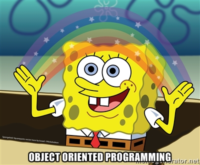

<!DOCTYPE html>
<html>
    <head>
            
    <body>
        <h1 style="text-align: center;"><b><I>0x06-Python-classes</I></b></h1>  
        
I am going to be taking a leap into the Object Oriented Programming Paradigm

        
       
 <b><i>Scan along with my code as I journey through OOP</i></b>

</body>
</html>
